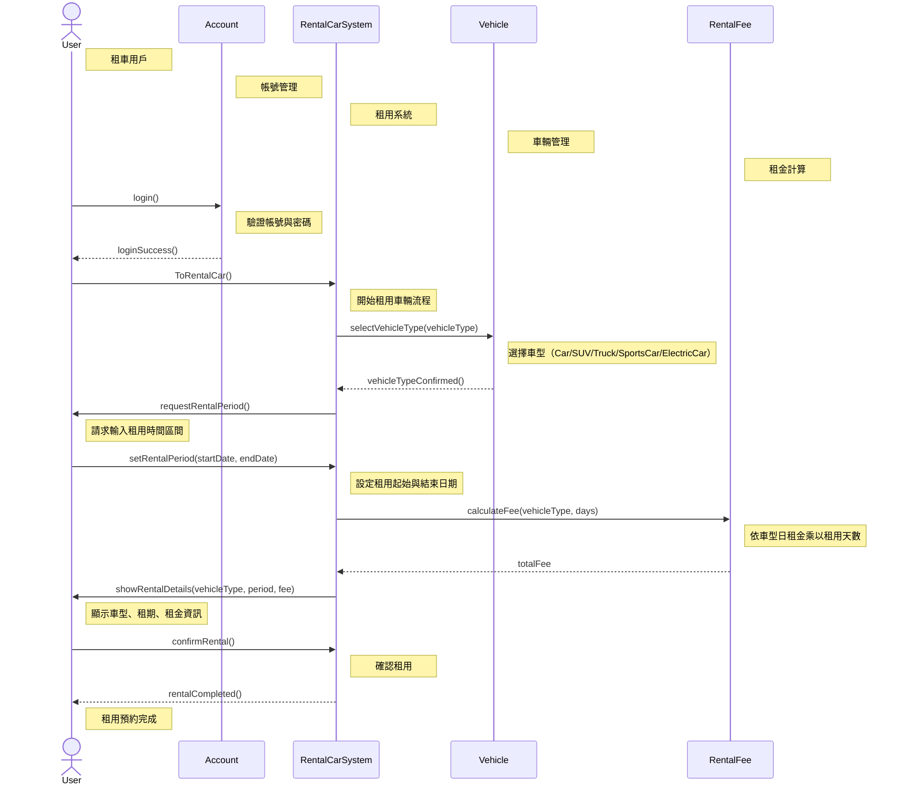

# SD_01 車輛租用系統

```mermaid
sequenceDiagram
    actor User as User
    participant Account
    participant RentalCarSystem
    participant Vehicle
    participant RentalFee

    Note right of User: 租車用戶
    Note right of Account: 帳號管理
    Note right of RentalCarSystem: 租用系統
    Note right of Vehicle: 車輛管理
    Note right of RentalFee: 租金計算

    User->>Account: login()
    Note right of Account: 驗證帳號與密碼
    Account-->>User: loginSuccess()
    
    User->>RentalCarSystem: ToRentalCar()
    Note right of RentalCarSystem: 開始租用車輛流程
    
    RentalCarSystem->>Vehicle: selectVehicleType(vehicleType)
    Note right of Vehicle: 選擇車型（Car/SUV/Truck/SportsCar/ElectricCar）
    Vehicle-->>RentalCarSystem: vehicleTypeConfirmed()
    
    RentalCarSystem->>User: requestRentalPeriod()
    Note right of User: 請求輸入租用時間區間
    User->>RentalCarSystem: setRentalPeriod(startDate, endDate)
    Note right of RentalCarSystem: 設定租用起始與結束日期
    
    RentalCarSystem->>RentalFee: calculateFee(vehicleType, days)
    Note right of RentalFee: 依車型日租金乘以租用天數
    RentalFee-->>RentalCarSystem: totalFee
    
    RentalCarSystem->>User: showRentalDetails(vehicleType, period, fee)
    Note right of User: 顯示車型、租期、租金資訊
    
    User->>RentalCarSystem: confirmRental()
    Note right of RentalCarSystem: 確認租用
    
    RentalCarSystem-->>User: rentalCompleted()
    Note right of User: 租用預約完成
```
