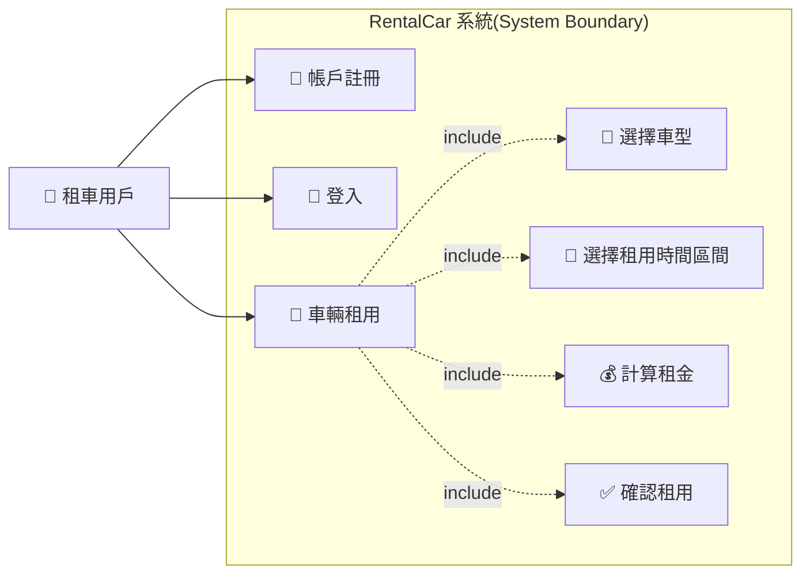

# RentalCar 線上預先車輛租用系統 - Use Case Diagram

```mermaid
flowchart LR
    User["👤 租車用戶"]
    
    subgraph RentalCarSystem["RentalCar 系統(System Boundary)"]
        UC1["📝 帳戶註冊"]
        UC2["🔐 登入"]
        UC3["🚗 車輛租用"]
        UC3_1["🚙 選擇車型"]
        UC3_2["📅 選擇租用時間區間"]
        UC3_3["💰 計算租金"]
        UC3_4["✅ 確認租用"]
    end
    
    User --> UC1
    User --> UC2
    User --> UC3
    
    UC3 -.->|include| UC3_1
    UC3 -.->|include| UC3_2
    UC3 -.->|include| UC3_3
    UC3 -.->|include| UC3_4
```